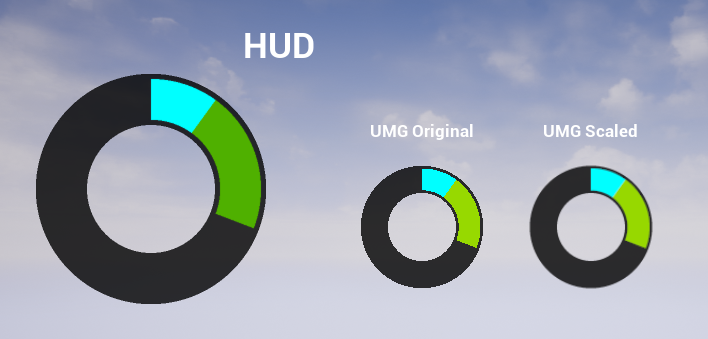

# GameNet-Challenge-TimeTap

Demo project created at stream for GameNet challenge "Game that makes the World better" (https://practicingfutures.org/gamedev)

Contains example of time tap controller with simple C++ gameplay code and radial progress bar material shader for visualisation.

Bonus: example how to remove aliasing from screen-space materials

